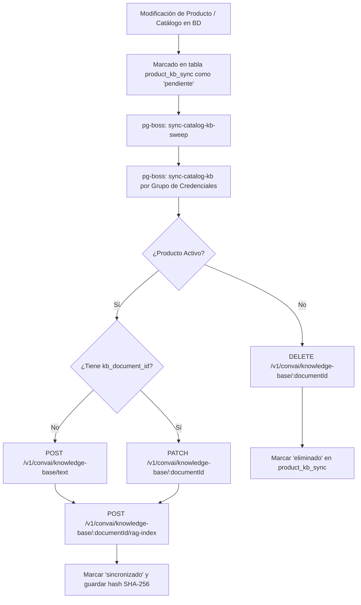

# Procedimiento de Sincronización del Catálogo con ElevenLabs Knowledge Base (RAG)

Este documento define la arquitectura, el procedimiento operativo y las reglas de diseño para la ingesta, sincronización y consulta de productos en la Knowledge Base (RAG) de **ElevenLabs Conversational AI** dentro de Datagol API.

---

## 1. Reglas Rectoras de Diseño

### 🎯 Regla 1: El precio y el stock NUNCA van a la Knowledge Base
* La Knowledge Base de ElevenLabs es un índice vectorial precalculado (estático). Si se incluye un precio o una cifra de inventario en la KB, ese dato queda congelado en el momento de la indexación.
* Un precio desactualizado dicho por el agente compromete legal y comercialmente al cliente.
* **Beneficio arquitectónico:** Los precios cambian frecuentemente (semanal/mensualmente); las descripciones cambian muy rara vez. Al excluir precios del RAG, **un cambio de precio nunca dispara resincronización hacia ElevenLabs**.

### 🎯 Regla 2: Separación Semántica vs Transaccional
* **Capa Semántica (ElevenLabs KB / RAG):** Permite al agente comprender el lenguaje natural del usuario, identificar qué producto busca, conocer sus beneficios/usos y obtener el **SKU** canónico.
* **Capa Transaccional en Vivo (Tool Call):** Con el SKU obtenido, el agente invoca en tiempo real la herramienta `POST /tools/:token/products` para consultar el precio vigente (con IVA y posibles overrides por sucursal) y el estado matizado de disponibilidad.

---

## 2. Estructura del Documento de Texto (`catalog-kb-document.ts`)

Por cada producto con al menos una variante activa, el backend sintetiza un documento en texto plano en español.

### Formato Estándar
```text
SKU: ARN-GEL-060

Gel de Árnica y Caléndula
Categoría: Cuidado Personal
Componentes activos: Extracto de árnica 10%, caléndula.
Uso sugerido: Aplicar en la zona afectada 3 veces al día.
Contraindicaciones: No aplicar sobre heridas abiertas.
Puntos de Lealtad: 50
Sabor: Menta Suave
Presentaciones: Tubo 60g, Tubo 120g.

Para precio y disponibilidad, consultar SKU ARN-GEL-060.
```

### Características Clave
1. **SKU Canónico:** Corresponde a la variante activa con el SKU alfabéticamente menor. Las demás presentaciones se describen como texto informativo.
2. **Campos Personalizados (`customFields`):** Si el catálogo tiene configurados campos personalizados con `include_in_rag: true` a nivel de producto (ej. "Puntos", "Sabor", "Laboratorio"), sus valores se inyectan automáticamente en el cuerpo descriptivo sin exponer precios ni existencias.
3. **Instrucción de Cierre:** La última línea indica explícitamente al agente que debe consultar el SKU mediante la herramienta disponible, evitando alucinaciones de costo.
4. **Hash SHA-256 (`synced_content_hash`):** Se calcula sobre el texto generado. Si un producto se reprocesa pero su hash no ha cambiado, el sistema salta la llamada a la API de ElevenLabs.

---

## 3. Flujo de Sincronización Asíncrona (Paso a Paso)



### Paso 1: Detección y Marcado (`product_kb_sync`)
* Al crear, importar mediante Excel/CSV o actualizar la descripción de un producto, se registra o actualiza su estado a `pendiente` en la tabla `product_kb_sync`.
* Las actualizaciones que modifican únicamente precios no tocan `product_kb_sync`.

### Paso 2: Agrupación y Lotes (`sync-catalog-kb-sweep`)
* El cron periódico de `pg-boss` ejecuta `syncCatalogKbSweepHandler`.
* Agrupa todos los productos pendientes por **Grupo de Credenciales** (`credential_group_id`). Esto procesa cientos de productos en un único lote ordenado, evitando saturar la API de ElevenLabs con llamadas concurrentes dispersas.

### Paso 3: Ejecución del Worker (`syncCatalogKbHandler`)
Para cada producto del lote:
1. **Carpeta por Catálogo (`kb_folder_id`):** Si el catálogo aún no tiene carpeta en ElevenLabs, invoca `POST /v1/convai/knowledge-base/folder` y guarda el ID retornado en `catalogs.kb_folder_id`.
2. **Evaluación de Hash:** Si el producto ya tiene `kb_document_id` y `synced_content_hash` coincide con el hash del contenido actual, se marca como `sincronizado` sin hacer peticiones externas.
3. **Publicación / Actualización:**
   - **Nuevo:** Envía `POST /v1/convai/knowledge-base/text` con `{ name, text: content, parent_folder_id: folderId }`.
   - **Existente:** Envía `PATCH /v1/convai/knowledge-base/:documentId` con `{ name, content }`.
   - **Inactivo / Eliminado:** Envía `DELETE /v1/convai/knowledge-base/:documentId` (un error 404 se trata como éxito idempotente).
4. **Indexación RAG Vectorial:**
   - Envía `POST /v1/convai/knowledge-base/:documentId/rag-index` con el modelo de embedding correspondiente: `{ "model": "e5_mistral_7b_instruct" }` (o `"multilingual_e5_large_instruct"`).
   - **Tolerancia a estados en procesamiento:** Si ElevenLabs devuelve `422` indicando que el documento ya se encuentra en procesamiento (`processing`), se asume como en curso y se persiste exitosamente el estado para evitar bloqueos.
5. **Persistencia de Estado:** Guarda el `kb_document_id`, el nuevo `synced_content_hash`, actualiza `rag_indexed_at` y marca el estado como `sincronizado`.

---

## 4. Resiliencia, Algoritmo de Backoff y Reintentos Automáticos

### ⏱️ Ciclo de Barrido y Detección
- **Frecuencia del Cron:** Un scheduler en `pg-boss` ejecuta `sync-catalog-kb-sweep` **cada 5 minutos** (`*/5 * * * *`).
- **Filtrado de Registros:** El barrido busca todas las filas con estado `pendiente` y `error`.

### 📈 Escala de Backoff Exponencial (`isDueForRetry`)
Para evitar saturar la API de ElevenLabs o caer en bloqueos por *Rate Limit* ante problemas temporales de red, cada fallo incrementa `attempts` y aplica una ventana de espera:
$$\text{Minutos de espera} = 2^{\min(\text{attempts}, 6)}$$

| Intento (`attempts`) | Tiempo de Espera Antes del Reintento | Comportamiento del Sweep |
|:---:|:---:|---|
| **1** | **2 minutos** | Se reintenta en el siguiente ciclo (~5 min) |
| **2** | **4 minutos** | Se reintenta en ~5–10 min |
| **3** | **8 minutos** | Se reintenta en ~10 min |
| **4** | **16 minutos** | Se reintenta en ~15–20 min |
| **5** | **32 minutos** | Se reintenta en ~30–35 min |
| **6+** | **64 minutos** | Tope máximo de espera |

* **Aislamiento por Producto:** Un producto individual que falle nunca detiene el procesamiento del resto del lote.
* **Monitoreo de Capacidad de KB (`getKbUsage`):** Antes de cada lote se consulta `GET /v1/convai/knowledge-base`. Si el número de documentos supera el 80% del límite del plan de ElevenLabs, se registra una advertencia estructurada en logs.

---

## 5. Recetas Operativas y Diagnóstico SQL (Supabase)

### Consultar Estado Agregado del HUD
```sql
SELECT * FROM v_kb_sync_status;
```

### Consultar Productos con Fallos de Sincronización
```sql
SELECT 
  p.name AS producto,
  s.product_id,
  s.kb_document_id,
  s.status,
  s.attempts,
  s.error,
  s.updated_at
FROM product_kb_sync s
JOIN products p ON p.id = s.product_id
WHERE s.status = 'error';
```

### Forzar Reintento Inmediato de Errores (Reseteo de Backoff)
```sql
UPDATE product_kb_sync
SET 
  status = 'pendiente',
  error = NULL,
  attempts = 0
WHERE status = 'error';
```

---

## 6. Consulta en Vivo durante la Conversación Telefónica

Durante el turno de conversación:
1. El interlocutor menciona un producto (ej. *"¿Tienen gel de árnica para dolor muscular?"*).
2. ElevenLabs consulta su índice RAG interno (< 100 ms) y recupera el texto del producto con su `SKU: ARN-GEL-060`.
3. El agente invoca el tool en vivo:
   ```http
   POST /tools/:webhookToken/products
   Content-Type: application/json
   x-tool-secret: <tool_secret>

   { "skus": ["ARN-GEL-060"] }
   ```
4. El backend resuelve la consulta en < 300 ms mediante la función Postgres `resolve_variant_for_org(p_org_id, p_sku)`:
   - Resuelve precios base o precios con descuento específico para la sucursal/organización.
   - Transforma el `stock_status` a un mensaje hablado matizado (ej. *"Me aparece con poca existencia"* o *"Es sobre pedido"*).
5. El agente responde al cliente con la información certera y actualizada al segundo.

---

## 7. Mapeo de Archivos del Proyecto

| Componente | Archivo | Responsabilidad |
|---|---|---|
| **Formato de Documentos** | `src/services/catalog-kb-document.ts` | Ensamblado del texto plano descriptivo y cálculo de hash SHA-256. |
| **Cliente de API ElevenLabs** | `src/services/elevenlabs-kb-client.ts` | Métodos HTTP (`POST /text`, `PATCH`, `DELETE`, `rag-index`, `folder`, `getKbUsage`). |
| **Jobs Asíncronos** | `src/jobs/sync-catalog-kb.ts` | Workers de `pg-boss` para el barrido y sincronización por lotes. |
| **Tool Call en Vivo** | `src/routes/tools/products.ts` | Endpoint de baja latencia invocado por el agente durante la llamada. |
| **Contratos de Tipos** | `src/types/product-kb-sync-status.ts` | Estados de sincronización (`pendiente`, `sincronizado`, `error`, `eliminado`). |
| **Pruebas Automatizadas** | `__tests__/sync-catalog-kb.test.ts`<br>`__tests__/catalog-kb-document.test.ts`<br>`__tests__/elevenlabs-kb-client.test.ts` | Cobertura completa y validación de contratos. |
