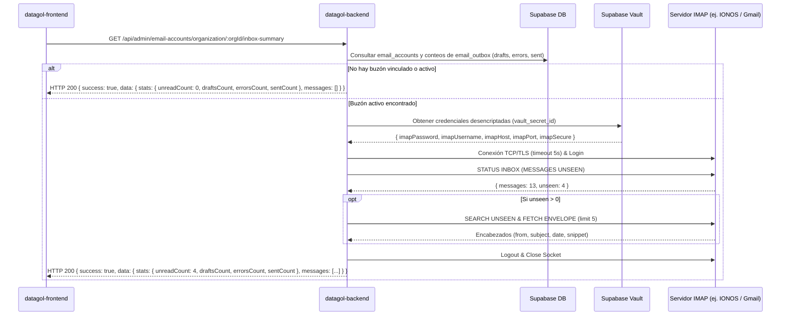

# Especificación Técnica en `datagol-backend` — Endpoint Consolidado de Resumen de Correo, Métricas y Pendientes (`email-summary`)

**Fecha:** 2026-08-22  
**Origen:** Integración nativa de correo multitenant (`email_accounts`), bitácora de envíos (`email_outbox`) y visualización de estadísticas y pendientes en el Dashboard (`PendingEmailsSection.tsx`).  

## 🎯 Objetivo

Implementar en `datagol-backend` un endpoint consolidado que devuelva las **4 métricas clave de correo** y la lista priorizada de tareas pendientes:
1. 📬 **Sin Leer (`unreadCount`):** Conteo y encabezados de correos no leídos en la bandeja `INBOX` del servidor IMAP del cliente (ej. IONOS, Google Workspace).
2. 📝 **Borradores (`draftsCount`):** Conteo de borradores generados por la IA en la tabla `email_outbox` pendientes de autorizar o enviar.
3. ⚠️ **Errores (`errorsCount`):** Conteo de fallos de entrega en `email_outbox` (`status = 'error'` o `status = 'failed'`) más fallos de socket en `email_accounts`.
4. 🚀 **Enviados (`sentCount`):** Total de correos despachados exitosamente (`status = 'sent'`).
5. 📋 **Tareas Pendientes (`tasks`):** Lista unificada de correos sin leer, borradores y errores ordenados por antigüedad y prioridad de fecha.

## 🔌 Especificación del Endpoint

### `GET /api/admin/email-accounts/organization/:orgId/inbox-summary`

- **Método HTTP:** `GET`
- **Autenticación:** `Authorization: Bearer <Supabase JWT>`
- **Autorización:** Membresía activa en `orgId` (`organization_members`) o rol `platform_admin`.

---

## 🏗️ Flujo de Ejecución en el Backend



### Paso a paso:

1. **Obtener la Cuenta de Correo y las Métricas de `email_outbox` en la DB:**
   ```sql
   -- 1.1 Cuenta activa
   SELECT id, email_address, imap_host, imap_port, imap_secure, imap_username, vault_secret_id, status, last_error
   FROM email_accounts
   WHERE organization_id = $1 AND status = 'active'
   LIMIT 1;

   -- 1.2 Métricas de email_outbox
   SELECT
     COUNT(*) FILTER (WHERE status = 'draft') AS drafts_count,
     COUNT(*) FILTER (WHERE status IN ('error', 'failed') OR error_message IS NOT NULL) AS errors_count,
     COUNT(*) FILTER (WHERE status = 'sent') AS sent_count
   FROM email_outbox
   WHERE organization_id = $1;
   ```

2. **Desencriptar Contraseña desde Supabase Vault:**
   Invocar la función interna o RPC de Vault usando la `service_role` key del backend:
   ```sql
   SELECT decrypted_secret
   FROM vault.decrypted_secrets
   WHERE id = $1;
   ```
   Parsear el JSON del secreto para extraer `imapPassword`.

3. **Consultar el Servidor IMAP (ej. `imapflow` o `node-imap`):**
   - Abrir conexión con **timeout estricto de 5000ms** (para no degradar el tiempo de carga del dashboard).
   - Opciones TLS:
     - Si `imap_port === 993` -> `secure: true` (TLS implícito).
     - Si `imap_port === 143` -> `secure: false` (STARTTLS).
   - Ejecutar comando de estado de buzón:
     ```javascript
     const mailbox = await client.status('INBOX', { messages: true, unseen: true });
     ```
   - Si `mailbox.unseen > 0`:
     - Buscar UIDs no leídos: `client.search({ unseen: true })`.
     - Obtener sobres de los últimos 5 correos no leídos:
       - `subject`
       - `from` (dirección y nombre)
       - `date` (formato ISO 8601 UTC)
       - `snippet` (primeros 120 caracteres de texto plano)
       - `uid` / `id`

4. **Consolidar Métricas y Tareas:**
   - Combinar los mensajes sin leer de IMAP con los borradores (`status = 'draft'`) y errores (`status = 'error'`) de `email_outbox`.
   - Calcular las estadísticas consolidadas:
     - `unreadCount`: `mailbox.unseen`
     - `draftsCount`: `drafts_count` de outbox
     - `errorsCount`: `errors_count` de outbox + (1 si `email_accounts.status === 'error'` else 0)
     - `sentCount`: `sent_count` de outbox

5. **Manejo de Errores y Resiliencia:**
   - Si el servidor IMAP falla o da timeout:
     - Actualizar `email_accounts.last_error = error.message` y devolver las métricas de DB (`draftsCount`, `errorsCount`, `sentCount`) con `unreadCount: 0` y el warning sin romper la petición con HTTP 500.

---

## 📦 Contrato JSON de Respuesta

### Formato compatible con el Frontend (`src/types/api-schemas.ts`):

```json
{
  "success": true,
  "data": {
    "unreadCount": 4,
    "draftsCount": 2,
    "errorsCount": 1,
    "sentCount": 18,
    "totalMessages": 13,
    "lastSyncedAt": "2026-08-22T16:15:00.000Z",
    "stats": {
      "unreadCount": 4,
      "draftsCount": 2,
      "errorsCount": 1,
      "sentCount": 18
    },
    "messages": [
      {
        "id": "msg-101",
        "uid": 101,
        "from": "portal@telnyx.com",
        "fromName": "Telnyx Portal",
        "subject": "Telnyx Global Voice Conversational...",
        "date": "2026-08-17T14:30:00.000Z",
        "snippet": "Actualización sobre el estado de tu cuenta...",
        "unread": true,
        "category": "unread"
      },
      {
        "id": "msg-102",
        "uid": 102,
        "from": "support@telnyx.com",
        "fromName": "Team Telnyx",
        "subject": "Important Rime TTS, Telnyx.Natural...",
        "date": "2026-08-14T09:15:00.000Z",
        "snippet": "Notificación técnica sobre modelos de voz...",
        "unread": true,
        "category": "unread"
      },
      {
        "id": "draft-201",
        "from": "info@datagol.net",
        "to": "director@holding.com",
        "subject": "Propuesta y resumen de llamada ejecutiva",
        "date": "2026-08-21T18:00:00.000Z",
        "snippet": "Estimado director, compartimos el resumen acordado...",
        "unread": false,
        "category": "draft"
      }
    ]
  }
}
```

---

## ⚡ Recomendaciones de Rendimiento y Caché

- **Caché en Memoria / Redis (TTL 60 segundos):** Devolver el snapshot en caché si se reciben peticiones repetidas en menos de 60 segundos.
- **Background Worker Opcional:** Opcionalmente, un worker periódico puede consultar el socket IMAP cada 5 minutos para que la respuesta de la API sea instantánea (<15ms).
