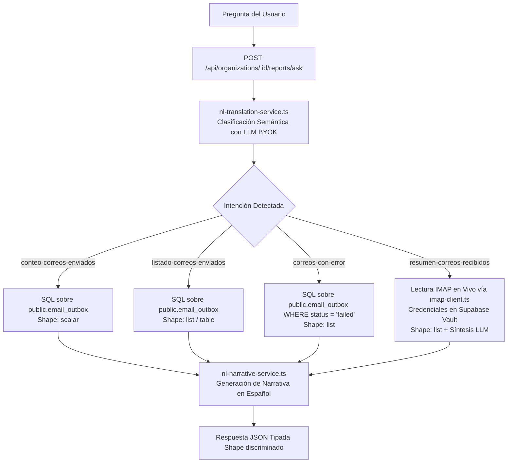

# TASK BACKEND: Soporte de Consultas en Lenguaje Natural para Buzones y Correos (`email_outbox` & IMAP)

**Proyecto:** `datagol-backend`  
**Módulo:** `src/services/reports/` (`nl-reports-service.ts`, `intents/`, `nl-translation-service.ts`)  
**Referencia obligatoria:** `AGENTS.md`, `docs/natural-language-reports.md` y `docs/manual-reportes-LN.md`

---

## 1. Contexto y Objetivo del Negocio

Una vez que la organización tiene vinculado su buzón de correo corporativo (`email_accounts`), el dueño de la PyME y los administradores deben poder formular preguntas en español cotidiano en `/dashboard/reports/ask` sobre la actividad de correos de su negocio:
- Métricas de envíos del agente y automatizaciones (`email_outbox`).
- Detección de fallos o rebotes de entrega.
- Consulta y resumen de correos recientes recibidos en su bandeja de entrada corporativa vía IMAP.

---

## 2. Arquitectura de Ejecución

El procesamiento sigue el estándar semántico-determinista de 3 fases de Datagol:



---

## 3. Catálogo de Nuevas Intenciones

### 3.1. `conteo-correos-enviados`
- **Propósito:** Responder cuántos correos se han enviado en un periodo (hoy, esta semana, este mes, etc.).
- **Shape de Salida:** `scalar`
- **Parámetros:**
  - `periodo` (requerido): Dimensión temporal (`NlPeriodParam`).
- **Consulta SQL:**
  ```sql
  SELECT COUNT(*)::int AS total
  FROM public.email_outbox
  WHERE organization_id = $1
    AND status = 'sent'
    AND created_at >= $2
    AND created_at <= $3;
  ```
- **Comparación:** Calcula el periodo anterior equivalente para generar la comparación porcentual (`comparison.value`, `comparison.direction`).

### 3.2. `listado-correos-enviados`
- **Propósito:** Mostrar los correos enviados recientemente por el sistema.
- **Shape de Salida:** `list` o `table`
- **Parámetros:**
  - `periodo` (opcional): Por defecto `este_mes`.
  - `limit` (opcional, default: 10).
- **Consulta SQL:**
  ```sql
  SELECT id, to_addresses, subject, status, created_at, sent_at
  FROM public.email_outbox
  WHERE organization_id = $1
    AND status IN ('sent', 'pending')
    AND created_at >= $2 AND created_at <= $3
  ORDER BY created_at DESC
  LIMIT $4;
  ```

### 3.3. `correos-con-error`
- **Propósito:** Identificar correos que fallaron en el envío o rebotaron.
- **Shape de Salida:** `list`
- **Parámetros:**
  - `periodo` (opcional, default `este_mes`).
- **Consulta SQL:**
  ```sql
  SELECT id, to_addresses, subject, error_message, created_at
  FROM public.email_outbox
  WHERE organization_id = $1
    AND status = 'failed'
    AND created_at >= $2 AND created_at <= $3
  ORDER BY created_at DESC
  LIMIT 15;
  ```
- **Formato UI:** Tarjetas rojas/ámbar con el destinatario, el asunto y la causa del fallo (`error_message`).

### 3.4. `resumen-correos-recibidos`
- **Propósito:** Consultar en vivo los correos recientes o no leídos del buzón corporativo.
- **Shape de Salida:** `list`
- **Flujo de Ejecución:**
  1. Obtener la cuenta activa principal de `public.email_accounts` para la organización.
  2. Recuperar la contraseña de aplicación descifrada desde Supabase Vault (`org:<id>:email_account:<accountId>`).
  3. Ejecutar búsqueda IMAP vía `imap-client.ts` buscando mensajes de los últimos 7 días o `UNSEEN` (máximo 15 mensajes).
  4. Extraer remitente (`from`), asunto (`subject`), fecha y snippet del cuerpo (primeros 200 caracteres).
  5. Si hay mensajes, pasar la lista de snippets al LLM configurado para sintetizar un resumen ejecutivo de 2 líneas en `narrative`.

---

## 4. Archivos a Modificar / Crear en `datagol-backend`

### 4.1. Tipos y Esquemas:
- **`src/types/natural-reports.ts`:**
  - Agregar al union `NlIntentKey`:
    `| 'conteo-correos-enviados' | 'listado-correos-enviados' | 'correos-con-error' | 'resumen-correos-recibidos'`
- **`src/schemas/natural-reports.ts`:**
  - Actualizar `rawLlmTranslationSchema` para aceptar las nuevas intenciones.

### 4.2. Módulos de Intención (`src/services/reports/intents/`):
- **`src/services/reports/intents/conteo-correos-enviados.ts`** [NEW]
- **`src/services/reports/intents/listado-correos-enviados.ts`** [NEW]
- **`src/services/reports/intents/correos-con-error.ts`** [NEW]
- **`src/services/reports/intents/resumen-correos-recibidos.ts`** [NEW]
- **`src/services/reports/intents/index.ts`:** Registrar los 4 módulos en el catálogo `INTENT_REGISTRY`.

### 4.3. Prompt del Clasificador Semántico:
- **`src/services/reports/nl-translation-service.ts`:**
  - Actualizar `buildTranslationPrompt` para incluir descripciones y ejemplos de las 4 nuevas intenciones en el catálogo prompt:
    - `"conteo-correos-enviados"`: *¿Cuántos correos se han mandado?, ¿cuántos emails salieron hoy?*
    - `"listado-correos-enviados"`: *¿Cuáles fueron los últimos correos enviados?, lista de correos de la semana*
    - `"correos-con-error"`: *¿Qué correos fallaron?, ¿hay errores de entrega de correo?*
    - `"resumen-correos-recibidos"`: *¿Qué correos me llegaron hoy?, ¿tengo correos pendientes de responder?, correos no leídos en mi buzón*

---

## 5. Criterios de Aceptación y QA

1. **Pruebas Unitarias de Intents:**
   - Crear `__tests__/nl-email-intents.test.ts` validando la ejecución de las 4 intenciones con mocks de base de datos y de IMAP.
2. **Pruebas de Clasificación Semántica:**
   - Probar que preguntas en español natural ("¿cuántos correos salieron hoy?", "¿tengo correos rebotados?") se traduzcan correctamente a su respectivo `intent`.
3. **Manejo Seguro de Errores IMAP:**
   - Si la organización no tiene un buzón vinculado (`email_accounts` vacío) y pregunta por correos entrantes, responder con `status: "no_data"` y mensaje: *"No tienes ningún buzón de correo vinculado en tu cuenta para consultar correos entrantes."*
4. **Verificación de Tipos:**
   - `pnpm type-check` (0 errores).
   - `pnpm test` (100% pruebas pasando).
