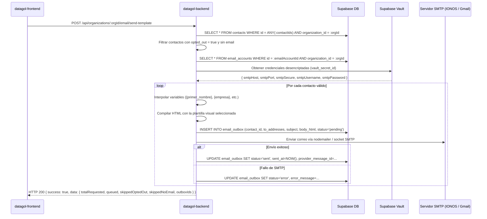

# Especificación Técnica en `datagol-backend` — Despacho de Correo con Plantilla Personalizada a Contactos (`send-template`)

**Fecha:** 2026-08-22  
**Origen:** Envío personalizado por lotes o individual desde el CRM ([`/dashboard/crm`](file:///home/justicary/proyectos/antigravity/mi-new-app/src/app/dashboard/crm/page.tsx)), integrando las plantillas de marca ([`/dashboard/settings/email`](file:///home/justicary/proyectos/antigravity/mi-new-app/src/app/dashboard/settings/email/page.tsx)) y los buzones IMAP/SMTP (`email_accounts`).  
**Estado en Frontend:** Implementado en `SendBatchEmailModal.tsx` y cliente en `src/lib/datagol-api/client.ts`.

## 🎯 Objetivo

Implementar en `datagol-backend` el endpoint `POST /api/organizations/:orgId/email/send-template` que recibe una lista de IDs de contactos (`contactIds`), un machote de correo con variables (ej. `{primer_nombre}`, `{empresa}`), una plantilla visual seleccionada (`template`) y el buzón emisor (`emailAccountId`), procediendo a:
1. Validar permisos y membresía del usuario en la organización.
2. Cargar los contactos desde PostgreSQL y **filtrar estrictamente aquellos con `opted_out = true`** (Cumplimiento LFPDPPP — AGENTS.md §11).
3. Filtrar aquellos contactos que no tengan `email` válido.
4. Desencriptar las credenciales SMTP de `email_accounts` desde Supabase Vault (`vault_secret_id`).
5. Renderizar el HTML de la plantilla seleccionada inyectando el cuerpo markdown y el logo/colores de la organización.
6. Encolar/despachar cada correo en la tabla `email_outbox` y enviarlo a través del socket SMTP del buzón.
7. Retornar el resumen de la operación (`queued`, `skippedOptedOut`, `skippedNoEmail`, `outboxIds`).

## 🔌 Especificación del Endpoint

### `POST /api/organizations/:orgId/email/send-template`

- **Método HTTP:** `POST`
- **Autenticación:** `Authorization: Bearer <Supabase JWT>`
- **Autorización:** Membresía activa en `orgId` con permiso de gestión de CRM (`contacts`) o rol `platform_admin`.

### Payload de Entrada (Request Body):

```json
{
  "emailAccountId": "56422ca1-ec44-45b4-9eac-7e068d9169be",
  "contactIds": [
    "c8a12345-0000-0000-0000-000000000001",
    "c8a12345-0000-0000-0000-000000000002"
  ],
  "template": "profesional",
  "subject": "Propuesta y resumen para {primer_nombre} — {mi_empresa}",
  "bodyMarkdown": "Hola {primer_nombre},\n\nFue un gusto conversar sobre {empresa}.\n\nAdjunto los detalles acordados...",
  "replyTo": "ventas@datagol.net",
  "attachments": [
    {
      "filename": "catalogo_servicios_2026.pdf",
      "contentType": "application/pdf",
      "contentBase64": "JVBERi0xLjQK...",
      "sizeBytes": 1048576
    }
  ]
}
```

### Campos del Request:
- `emailAccountId` *(string UUID, obligatorio)*: ID del buzón en `email_accounts` que emitirá los correos.
- `contactIds` *(array de UUIDs, 1 a 100 elementos)*: Lista de contactos destinatarios.
- `template` *(string enum, opcional)*: Uno de `profesional`, `minimalista`, `corporativo`, `calido`, `compacto`. Si no se envía, toma la configurada en `organizations.integration_settings.email`.
- `subject` *(string, obligatorio, max 200 caracteres)*: Asunto del correo, con soporte para variables `{primer_nombre}`, `{nombre_completo}`, `{empresa}`, `{mi_empresa}`.
- `bodyMarkdown` *(string, obligatorio, max 10,000 caracteres)*: Cuerpo del correo en Markdown o texto enriquecido con variables dinámicas.
- `replyTo` *(string email, opcional)*: Dirección de respuesta.
- `attachments` *(array de objetos, opcional, max 5 archivos, límite comercial combinado de 10 MB)*:
  - `filename`: Nombre del archivo (ej. `propuesta.pdf`).
  - `contentType`: MIME type (ej. `application/pdf`, `image/png`).
  - `contentBase64`: Contenido codificado en Base64.
  - `sizeBytes`: Tamaño en bytes.

---

## 🏗️ Flujo de Ejecución en el Backend



### Reglas Críticas de Seguridad y Cumplimiento:
1. **LFPDPPP (Derecho de Oposición):** Si `contacts.opted_out === true`, el backend **NUNCA** envía el correo y lo suma a `skippedOptedOut`.
2. **Idempotencia:** Generar una `idempotency_key` única por combinación de `(organization_id, contact_id, hash(subject + body + timestamp_hour))` para evitar dobles envíos en peticiones repetidas.
3. **Manejo de Errores SMTP:** Si un correo falla, el fallo se registra individualmente en `email_outbox.error_message` sin abortar el resto del lote.

---

## 📦 Respuesta JSON Exitosa

```json
{
  "success": true,
  "data": {
    "totalRequested": 3,
    "queued": 2,
    "skippedOptedOut": 1,
    "skippedNoEmail": 0,
    "outboxIds": [
      "8f12a345-0000-0000-0000-000000000001",
      "8f12a345-0000-0000-0000-000000000002"
    ]
  }
}
```
