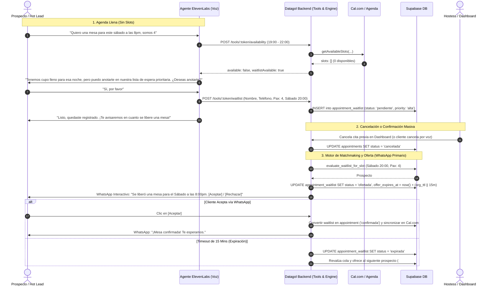

# Plan de Implementación: Sistema de Lista de Espera Inteligente (Waitlist) & Confirmación Masiva

Este documento define la arquitectura, contratos SSOT, motor de matchmaking y distribución de tareas en **`datagol-backend`** para la funcionalidad de **Lista de Espera (Waitlist)** y **Confirmación Masiva de Citas**.

---

## Directrices y Criterios Incorporados

> [!IMPORTANT]
> 1. **Entitlement & Feature Gating:** La funcionalidad `'waitlist'` es una **nueva FEATURE técnica** exclusiva para los planes **`elite`** y **`enterprise`** (registrada en `features` y `plan_features`). En planes inferiores (`starter`, `pro`), el frontend mostrará el tab con candado/badge de upgrade hacia el plan Elite.
> 2. **Canal Primario de Notificación:** **WhatsApp Interactivo** (con botones rápidos de *Aceptar* / *Rechazar* o enlace de confirmación de 1 clic) para minimizar costos de infraestructura y maximizar conversión de lectura. El canal de **Voz (Llamada saliente con ElevenLabs)** operará como **canal de respaldo** si el cliente no responde dentro de la ventana o si el negocio carece de canal WhatsApp activo.
> 3. **Tolerancia y Expiración (TTL):** **Configurable por organización** (en `integration_settings.waitlist_ttl_minutes` o configuración de agenda), con un valor predeterminado estricto de **15 minutos**.
> 4. **Integración con Cancelación en Dashboard:** En `src/app/dashboard/appointments/page.tsx` (líneas 337-374), cuando una cita se marca como `cancelada`, el sistema disparará la evaluación de candidatos en cola para ofrecer la reasignación inmediata del espacio.

---

## Flujo de Negocio y Arquitectura



---


## Detalle de Tareas: `datagol-backend`

### Tarea B1: Migración SQL (`64_appointment_waitlist.sql`)
1. **Feature y Entitlements:**
   ```sql
   insert into features (key, name, description, category, has_cost_impact, sort_order)
   values ('waitlist', 'Lista de espera y confirmación masiva',
           'Cola de espera automática para reasignar citas canceladas y confirmación masiva',
           'operacion', false, 190)
   on conflict (key) do nothing;

   insert into plan_features (plan_key, feature_key) values
     ('elite', 'waitlist'),
     ('enterprise', 'waitlist')
   on conflict do nothing;

   insert into permissions (key, name, description, category, is_sensitive, sort_order) values
     ('view_waitlist',   'Ver lista de espera',      'Consultar prospectos en cola', 'datos',     false, 180),
     ('manage_waitlist', 'Gestionar lista de espera','Asignar mesas y reevaluar',    'operacion', false, 190)
   on conflict (key) do nothing;

   insert into role_permissions (role, permission_key) values
     ('viewer', 'view_waitlist'),
     ('member', 'view_waitlist'),
     ('admin',  'view_waitlist'), ('admin',  'manage_waitlist'),
     ('owner',  'view_waitlist'), ('owner',  'manage_waitlist')
   on conflict do nothing;
   ```

2. **Tabla `appointment_waitlist`:**
   ```sql
   CREATE TABLE appointment_waitlist (
       id uuid PRIMARY KEY DEFAULT gen_random_uuid(),
       organization_id uuid NOT NULL REFERENCES organizations(id) ON DELETE CASCADE,
       contact_id uuid REFERENCES contacts(id) ON DELETE SET NULL,
       call_log_id uuid REFERENCES call_logs(id) ON DELETE SET NULL,
       conversation_id text,
       customer_name text NOT NULL,
       customer_phone text NOT NULL,
       customer_email text,
       party_size integer NOT NULL DEFAULT 2,
       preferred_date_start date NOT NULL,
       preferred_date_end date NOT NULL,
       preferred_time_start time,
       preferred_time_end time,
       status text NOT NULL DEFAULT 'pendiente' 
           CHECK (status IN ('pendiente', 'ofertada', 'confirmada', 'rechazada', 'expirada', 'cancelada')),
       priority text NOT NULL DEFAULT 'normal' 
           CHECK (priority IN ('alta', 'normal', 'baja')),
       offered_appointment_id uuid REFERENCES appointments(id) ON DELETE SET NULL,
       offered_at timestamptz,
       offer_expires_at timestamptz,
       notification_channel text NOT NULL DEFAULT 'whatsapp'
           CHECK (notification_channel IN ('whatsapp', 'voice', 'sms')),
       notes text,
       created_at timestamptz NOT NULL DEFAULT now(),
       updated_at timestamptz NOT NULL DEFAULT now()
   );

   CREATE INDEX idx_waitlist_org_status ON appointment_waitlist(organization_id, status, priority, created_at);
   CREATE INDEX idx_waitlist_dates ON appointment_waitlist(organization_id, preferred_date_start, preferred_date_end);
   ```

### Tarea B2: Tool de ElevenLabs (`src/routes/tools/waitlist.ts`)
1. Implementar `POST /tools/:webhookToken/waitlist`:
   - Valida que la organización tenga el entitlement `waitlist` activo (o degrada con cortesía si el plan no lo soporta).
   - Recibe: `customerName`, `customerPhone`, `partySize`, fechas y ventana horaria.
   - Si el prospecto ya existe o proviene de una llamada clasificada como hot lead, asigna `priority: 'alta'`.
   - Devuelve confirmación verbalizable instantánea (<300ms).
2. Actualizar `src/routes/tools/availability.ts`:
   - Cuando no hay slots disponibles y la organización tiene `waitlist`, retorna `waitlistAvailable: true` y sugerencia de diálogo para el agente.

### Tarea B3: Motor de Matchmaking (`src/services/waitlist-engine.ts`)
1. Al liberarse una cita (por cancelación en dashboard, por voz o por reconciliación):
   - Lee el TTL configurado en la organización (`organization.integration_settings.waitlist_ttl_minutes` || `15`).
   - Busca en `appointment_waitlist` el mejor match (`status = 'pendiente'`, fecha/hora coincidente, `party_size` adecuado).
   - Ordena por `priority DESC, created_at ASC`.
   - Transiciona a `status = 'ofertada'` y `offer_expires_at = now() + interval '15 minutes'`.
   - **Canal Primario:** Envía mensaje interactivo por **WhatsApp** con botones de confirmación o link de un clic.
   - **Respaldo:** Si la organización no tiene WhatsApp o el envío falla, dispara llamada saliente vía `/api/voice/outbound`.

### Tarea B4: Orquestador de Confirmación Masiva (`src/jobs/bulk-appointment-confirmation.ts`)
1. `POST /api/organizations/:id/appointments/bulk-confirm`:
   - Filtra citas de la fecha seleccionada.
   - Dispara confirmación por WhatsApp o agente de voz.
   - Cualquier cancelación resultante alimenta automáticamente a `waitlist-engine.ts`.
2. Job `check-waitlist-expirations.ts`:
   - Corre cada 2-5 minutos verificando `offer_expires_at < now()`.
   - Pasa las ofertas vencidas a `expirada` y promueve al siguiente prospecto.

## Plan de Verificación y Testing

### Pruebas Unitarias Automatizadas
```bash
# 1. Verificar sincronización de contratos SSOT
pnpm test __tests__/constraints.test.ts

# 2. Tipado y Linter
pnpm type-check
pnpm lint
```

### Verificación Manual de Flujo
1. Verificar que una organización con plan `pro` no pueda ver la gestión operativa de lista de espera y reciba el prompt de upgrade a plan `elite`.
2. Con plan `elite`, crear un prospecto en lista de espera para mañana a las 20:00 (pax: 2).
3. Cancelar una cita existente de las 20:00 en `AppointmentsPage` y verificar que el sistema ejecute la oferta por WhatsApp respetando el TTL de 15 minutos.
