# TASK — Persistencia Inmediata y Atómica de Leads ("Zero Lead Loss") en Outbound Demo

**Proyecto:** `datagol-backend` (Fastify + Node + Supabase)  
**Origen:** Incidente de producción 2026-08-28 (Timeout en móvil + llamada diferida con pérdida de lead).  
**Referencias cruzadas:** `docs/tasks/outbound-lead-persistence-and-rate-limit.md`, `src/routes/voice.ts`, `src/adapters/voice/elevenlabs.adapter.ts`.

---

## 1. El Problema Detectado (Causa Raíz)

En la especificación anterior (`outbound-lead-persistence-and-rate-limit.md` §1.3), se planteó sembrar el contacto/lead **después** de que `provider.triggerOutboundCall(...)` respondiera con éxito.

### Por qué falló en la práctica:
1. **Latencia de Señalización SIP/ElevenLabs:** `triggerOutboundCall` toma entre 15 y 35 segundos en negociar con el carrier telefónico.
2. **Desconexión o Cancelación:** Si la llamada falla (error de carrier, saldo de minutos, SIP 405/500), si ElevenLabs arroja timeout o si el cliente aborta la conexión HTTP mientras espera, **la siembra nunca se ejecuta**.
3. **Pérdida Inaceptable del Prospecto:** Los datos capturados por el prospecto en el formulario (`customerName`, `customerPhone`, `customerEmail`, `companyName`, `industry`, `demoObjective`, `source`, `sourceDetail`) se destruyen sin llegar a `contacts` ni a `leads`.

---

## 2. Nueva Política Obligatoria: Store-First (Zero Lead Loss)

> **Regla de Oro:** Todo dato capturado en un formulario web de demostración o prospección debe persistirse en Supabase de forma **atómica, síncrona e inmediata** tan pronto como la solicitud entra a `POST /api/voice/outbound`, **ANTES** de invocar la API de ElevenLabs / Telnyx.

```mermaid
sequenceDiagram
    autonumber
    participant UI as datagol-frontend (/api/outbound/demo)
    participant API as datagol-backend (/api/voice/outbound)
    participant DB as Supabase DB
    participant Voice as ElevenLabsAdapter / SIP Trunk

    UI->>API: POST /api/voice/outbound (datos completos del prospecto)
    
    rect rgb(20, 50, 30)
    Note over API,DB: FASE 1: PERSISTENCIA INMEDIATA (STORE-FIRST)
    API->>DB: 1. Normalizar teléfono a E.164
    API->>DB: 2. Upsert en "contacts" (phone_e164, first_name, email)
    API->>DB: 3. Insert/Upsert en "leads" (org_id, contact_id, business_name, sector, source, objective, stage='nuevo')
    DB-->>API: Retorna { contact_id, lead_id }
    end

    rect rgb(30, 40, 60)
    Note over API,Voice: FASE 2: DISPARO DE TELEFONÍA (DESACOPLADO)
    API->>Voice: provider.triggerOutboundCall(..., customVariables: { leadId, contactId, ... })
    alt Éxito en ElevenLabs (HTTP 200)
        Voice-->>API: { callId, conversationId }
        API->>DB: Actualizar lead / call_logs con conversationId
        API-->>UI: 200 { success: true, leadId, callStatus: 'initiated' }
    else Error / Timeout en ElevenLabs / Fallo SIP
        Voice-->>API: Error (500, 405, 429, Timeout)
        API->>DB: Registrar en lead notes ("Llamada saliente falló: [motivo]. Requiere contacto manual.")
        API-->>UI: 200 { success: true, leadId, callStatus: 'call_failed_lead_saved', message: 'Datos guardados. Un asesor te contactará en breve.' }
    end
    end
```



---

## 3. Especificación de Implementación

### 3.1. Extracción y Normalización de Parámetros en `src/routes/voice.ts`
En `handleVoiceOutbound`:
* Leer todos los campos del payload:
  ```ts
  const {
    organizationId,
    customerPhone,
    customerName,
    customerEmail,
    companyName,
    industry,
    demoObjective,
    source,
    sourceDetail,
  } = request.body;
  ```
* Normalizar el teléfono con `normalizePhoneE164(customerPhone)`. Si falla, rechazar con `400 Bad Request`.

### 3.2. Paso 1 — Persistencia Inmediata Previa (Store-First)
Antes de llamar a `provider.triggerOutboundCall`, ejecutar la persistencia en Supabase usando `fastify.supabaseAdmin`:

1. **Upsert en `contacts`:**
   ```sql
   INSERT INTO public.contacts (organization_id, phone_e164, first_name, email)
   VALUES (p_org_id, p_phone_e164, p_first_name, p_email)
   ON CONFLICT (organization_id, phone_e164)
   DO UPDATE SET
     first_name = COALESCE(EXCLUDED.first_name, public.contacts.first_name),
     email = COALESCE(EXCLUDED.email, public.contacts.email),
     updated_at = now()
   RETURNING id;
   ```
2. **Insert en `leads`:**
   ```sql
   INSERT INTO public.leads (
     organization_id,
     contact_id,
     channel,
     pipeline_stage,
     full_name,
     email,
     business_name,
     business_sector,
     inquiry_reason,
     source,
     source_detail
   ) VALUES (
     p_org_id,
     v_contact_id,
     'outbound',
     'nuevo',
     p_first_name,
     p_email,
     p_company_name,
     p_industry,
     p_demo_objective,
     COALESCE(p_source, 'web_landing'),
     p_source_detail
   )
   RETURNING id;
   ```
*(Nota: Puede implementarse mediante un RPC dedicado `seed_outbound_lead` o query directa con `supabaseAdmin`).*

### 3.3. Paso 2 — Disparo de Telefonía y Resiliencia ante Excepciones
* Invocar `provider.triggerOutboundCall(...)` envolviéndolo en un bloque `try/catch`.
* Incluir `leadId` y `contactId` en `customVariables` para que ElevenLabs los conserve en la metadata de la llamada.
* **Si ElevenLabs falla:**
  * **NO** propagar un error 500 al cliente que haga parecer que nada se procesó.
  * Actualizar el lead recién creado con una nota explicativa (ej. `outbound_error: "ElevenLabs rejected: [error]"`).
  * Responder al cliente HTTP con:
    ```json
    {
      "success": true,
      "leadId": "uuid-del-lead",
      "contactId": "uuid-del-contacto",
      "callStatus": "call_failed_lead_saved",
      "message": "Tus datos han sido registrados exitosamente. Nos comunicaremos contigo en breve."
    }
    ```

### 3.4. Paso 3 — Fusión en el Post-Call Webhook
Cuando el webhook de transcripción (`post_call_transcription`) de ElevenLabs reciba la llamada finalizada:
* Enlazar la transcripción y grabación en `call_logs` apuntando al `lead_id` y `contact_id` creados en el Paso 1.
* Actualizar la temperatura, citas agendadas o notas de seguimiento en `leads` sin duplicar el registro del prospecto.

---

## 4. Criterios de Aceptación (DoD)

- [ ] Si ElevenLabs está caído, sin saldo o rechaza la llamada (HTTP 405/500/429), el prospecto **aparece visible de inmediato en la tabla `leads` y en el Kanban del Dashboard**.
- [ ] Todos los campos del formulario (`fullName`, `email`, `phone`, `company`, `industry`, `goal`, `source`, `sourceDetail`) quedan guardados con sus valores exactos, sin `null` injustificados.
- [ ] La respuesta de `POST /api/voice/outbound` incluye `leadId` y `contactId` en todos los flujos.
- [ ] Las pruebas automatizadas en `datagol-backend` (`pnpm test`) simulan un fallo forzado de ElevenLabs y comprueban que el lead se persiste correctamente en base de datos.
